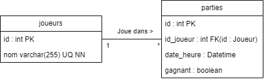

# Punto API

Cette API est dédié pour le jeu Punto. Elle permet de gérer des joueurs et des parties pour un jeu fictif appelé Punto.
L'API est développée en utilisant FastAPI et prend en charge les bases de données MongoDB, MySQL, et SQLite.

## Fonctionnalités

L'API offre les fonctionnalités suivantes :

- Création de joueurs
- Enregistrement de parties avec indication du gagnant
- Consultation du nombre total de parties jouées par un joueur
- Consultation du nombre de parties gagnées par un joueur
- Obtention d'informations détaillées sur un joueur (nom, nombre total de parties, nombre de parties gagnées)
- Suppression de l'enssemble des joueurs et des parties

## Installation

Pour installer et exécuter l'API localement, suivez ces étapes :

1. Clonez le dépôt :
   ```bash
   git clone https://github.com/Max1me44/punto-api.git
   cd punto-api
   ```

2. Installez les dépendances (vous pouvez créer un environnement virtuel au préalable) :
    ```bash
    pip install -r requirements.txt
    ```

3. Exécutez l'application :
    ```bash
    uvicorn main:app --reload
    ```
   L'API sera accessible à l'adresse http://127.0.0.1:8000. La documentation interactive Swagger est disponible
   à http://127.0.0.1:8000/docs.

## Configuration de la base de données

- L'API prend en charge trois bases de données : MongoDB, MySQL, et SQLite. Assurez-vous d'avoir une base de données
  disponible.
- Pour la base de données MongoDB, vous aurez simplement besoin de spécifier l'URL de connexion dans le
  fichier `punto-api/app/mongodb/database.py`(ligne 10). Les collections nécessaires seront créées automatiquement.
- Pour les bases de données SQLite, vous n'auriez rien à faire. SQLite est une base de données embarquée. Les tables
  seront créés automatiquement dans le fichier `punto-api/punto.db`.
- Pour la base de données MySQL, vous aurez besoin de spécifier l'URL de connexion dans le
  fichier `punto-api/app/mysql/database.py`(ligne 5). Les tables nécessaires seront créées automatiquement.

### Endpoint

Chaque endpoint est décrit ci-dessous. Les types de base de données supportés sont mysql, mongodb, et sqlite.

### Création d'un joueur

```bash
POST (typeBDD)/parties/create/
```

Permet de créer un nouveau joueur en spécifiant son nom.

### Création d'une partie

```bash
POST (typeBDD)/parties/create/
```

Enregistre une nouvelle partie avec le nom du joueur et l'indication s'il a gagné ou non.

### Informations sur un joueur

```bash
GET (typeBDD)/joueurs/{nom}/
```

Obtient des informations détaillées sur un joueur, y compris le nombre total de parties et le nombre de parties gagnées.

### Nombre total de parties d'un joueur

```bash
GET (typeBDD)/joueurs/{nom}/nombre_parties/
```

Renvoie le nombre total de parties jouées par un joueur.

### Nombre de parties gagnées par un joueur

```bash
GET (typeBDD)/joueurs/{nom}/nombre_parties_gagnees/
```

Renvoie le nombre de parties gagnées par un joueur.

### Suppression de tous les joueurs et parties

```bash
POST (typeBDD)/reset/all/
```

Supprime tous les joueurs et parties de la base de données.

## Explication des tables

Il existe deux tables dans la base de données : `joueurs` et `parties`.
Chaque joueur est identifié par un id unique et un nom unique.
Chaque partie est identifiée par un id unique, l'id d'un joueur, une date/heure et un booléen indiquant si le joueur a
gagné ou non.


`SQLAlchemy` est une bibliothèque Python qui fournit des outils pour travailler avec des bases de données relationnelles.
Elle est utilisée dans cette API pour interagir avec les bases de données MySQL, MongoDB, et SQLite 
(définition des modèles de données, initialisation de la base de données, opérations CRUD (Create, Read, Update, Delete), routes API).

### Schéma Relationnel

1. MySQL  
   Table "joueurs"

   | id (PK) | nom (unique) |
   |---------|--------------|
   | Integer | String       |

   Table "parties"

   | id (PK) | joueur_id (FK) | date_heure (Default: NOW) | gagnant |
   |---------|----------------|---------------------------|---------|
   | Integer | Integer        | DateTime                  | Boolean |

2. MongoDB  
   Collection "joueurs"

    ```json
    {
      "_id": ObjectId,
      "nom": String
    }
    ```

   Collection "parties"

    ```json
    {
      "_id": ObjectId,
      "id_joueur": ObjectId,
      "date_heure": Datetime,
      "gagnant": Boolean
    }
    ```

3. SQLite
   Table "joueurs"

    | id (PK) | nom (unique) |
    |---------|--------------|
    | Integer | String       |

    Table "parties"

   | id (PK) | joueur_id (FK) | date_heure (Default: NOW) | gagnant |
   |---------|----------------|---------------------------|---------|
   | Integer | Integer        | DateTime                  | Boolean |

### Diagrammes ER (Entité-Relation)

1. MySQL  
   
2. MongoDB  
   MongoDB utilise une structure de données de type document, et n'a pas de schéma fixe. Les données sont stockées sous
   forme de documents JSON, et chaque document peut avoir des champs différents.
3. SQLite
    
